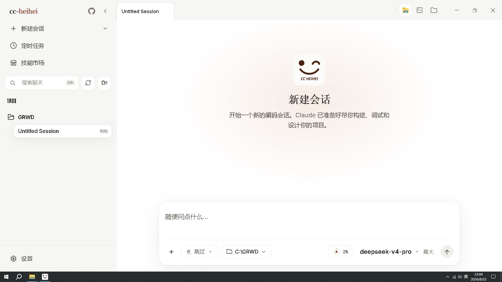
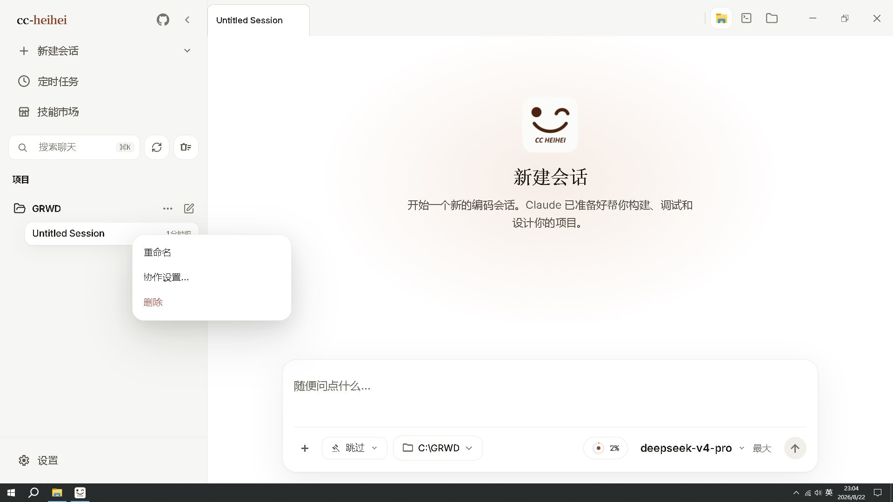
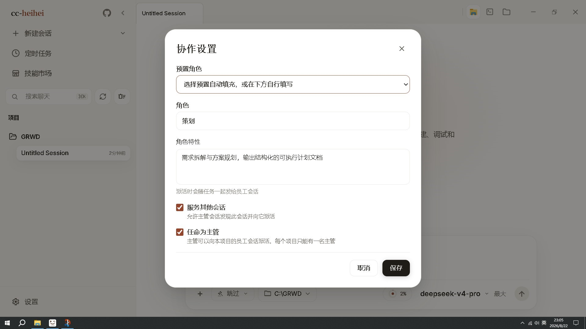
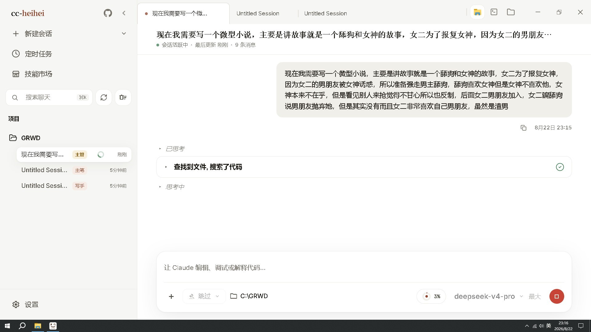

# Claude Code Heihei

<p align="center">
  
</p>

<div align="center">

[](LICENSE)

[English](README.md) · **简体中文**

</div>

Claude Code Heihei 是一个 **macOS / Windows / Linux 桌面端 Claude Code 工作台**。它在经典会话工作台之上新增了 **会话级上下级协作** 能力，同时保留多会话、多项目、Diff 审阅、权限审批、模型配置、Computer Use、技能市场、定时任务等完整能力。

## 下载

[](https://github.com/KyuuKyuuStone/claude-code-heihei/releases/latest/download/Claude-Code-Heihei-1.0.0-win-x64.exe)

> 更多平台与版本见 [Releases](https://github.com/KyuuKyuuStone/claude-code-heihei/releases)。

## 界面预览

|  |  |
|:--:|:--:|
|  |  |
|  |  |

## 功能特性

### 会话级上下级协作（本项目新增）

- **主管 / 员工**：每个项目任命一名「主管」，把任意会话登记为「员工」，角色与特性自由定义（后端 / 前端 / 写作 / 绘画师…）。
- **自动派活**：主管向员工会话派活，员工会话无人值守自动执行（自动放行权限），完工后自动汇报。
- **验收交付**：主管收到汇报后验收，继续派活或向用户交付。
- **项目隔离**：花名册与派活都按工作目录隔离，跨项目派活会被服务端直接拒绝。

### 会话工作台

- **多会话**：标签页、项目切换、终端入口、会话历史集中管理。
- **分支 / Worktree**：新建会话可选仓库分支，决定用当前工作树还是隔离 Worktree。
- **逐文件 Diff 审阅**：列出本轮改动，任意文件一键打开带语法高亮的 Diff，支持整轮撤销。

### AI 能力

- **多 Agent**：SubAgent / Agent Teams，子代理继承上下文协同工作。
- **技能市场**：发现、预览、安装来自 ClawHub / SkillHub 的第三方技能，来源与安全状态摆在明处。
- **Skills 系统**：把流程固化成技能，随会话自动加载。
- **记忆系统**：自动记忆 + AutoDream 提炼长期记忆。
- **Computer Use**：授权后让 Agent 截图、点击、输入并控制桌面应用。
- **MCP 支持**：接入 MCP 工具与外部能力。

### 其他

- **权限模式**：五档权限，从「每次都问」到「跳过权限」，危险命令、工具调用和 AI 反问都在桌面端审批。
- **自带模型**：通过 API Key 添加服务商，DeepSeek、Kimi、智谱 GLM 等第三方有现成预设，也支持 LM Studio、Ollama 本地模型。
- **三套配色主题**：纯白、纸墨、墨夜蓝，可跟随系统深浅色自动切换。
- **定时任务与用量统计**：计划任务在独立会话里执行，查看本机 Token 使用趋势。

## 从源码启动 CLI

适合想调试底层 CLI、服务端或自行开发的用户：

```bash
bun install
cp .env.example .env
./bin/claude-heihei
```

更多配置见 [环境变量](docs/cli/env.md) 和 [命令行安装与启动](docs/cli/index.md)。

## 更多文档

| 分区 | 文档 |
|------|------|
| **开始使用** | [这是什么](docs/start/index.md) · [下载与安装](docs/start/install.md) · [连接模型服务](docs/start/models.md) · [跑通第一条会话](docs/start/first-session.md) · [故障排查](docs/start/troubleshooting.md) |
| **桌面端功能** | [功能总览](docs/desktop/index.md) · [Computer Use](docs/desktop/computer-use.md) |
| **命令行** | [安装与启动](docs/cli/index.md) · [命令参考](docs/cli/reference.md) · [环境变量](docs/cli/env.md) |
| **深入原理** | [桌面端架构](docs/internals/desktop.md) · [多 Agent 系统](docs/internals/agent.md) · [Skills 系统](docs/internals/skills.md) · [记忆系统](docs/internals/memory.md) · [Computer Use 架构](docs/internals/computer-use.md) · [本地 Server 与 API](docs/internals/server.md) · [Channel 系统](docs/internals/channel.md) · [项目结构](docs/internals/structure.md) |

## 赞助

如果这个项目对你有帮助，欢迎扫码赞助，支持我们持续开发 ❤️

<p align="center">
  
  
</p>

## 反馈与联系

使用中遇到问题或有改进建议，欢迎通过以下方式联系：

- 邮箱：[511829667@qq.com](mailto:511829667@qq.com)
- GitHub Issues：[提交问题](https://github.com/KyuuKyuuStone/claude-code-heihei/issues)

## 技术栈

| 类别 | 技术 |
|------|------|
| 语言 | TypeScript |
| 桌面 APP | Electron |
| 桌面 UI | React + Vite |
| 本地运行时 | [Bun](https://bun.sh) |
| 终端 UI | React + [Ink](https://github.com/vadimdemedes/ink) |
| CLI 解析 | Commander.js |
| API | Anthropic SDK |
| 协议 | MCP, LSP |

## 致谢

本项目站在以下项目的肩膀上：

- [cc-haha](https://github.com/NanmiCoder/cc-haha) —— 本项目 fork 自它的上游桌面工作台（MIT）。感谢 NanmiCoder 与 cc-haha 社区。
- [Claude Code](https://claude.com/claude-code) / [Anthropic](https://www.anthropic.com) —— 底层的 agent 运行时与 [Anthropic SDK](https://github.com/anthropics/anthropic-sdk-typescript)。

同时感谢 [DeepSeek](https://www.deepseek.com) 协助完成本项目代码的开发与改造，以及以下开源项目和社区实践为本项目提供参考与启发：

- [React](https://github.com/facebook/react)：前端工程与组件化 UI 生态。
- [Electron](https://github.com/electron/electron)：跨端桌面应用能力与工程实践。
- [cc-switch](https://github.com/farion1231/cc-switch)：模型供应商配置能力参考。
- [LINUX DO](https://linux.do/)：新的理想型开发者社区。
